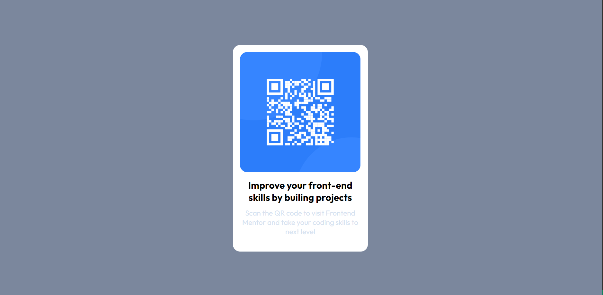

# Frontend Mentor - QR code component solution

This is a solution to the [QR code component challenge]
## Table of contents

- [Overview](#overview)
  - [Screenshot](#screenshot)
  - [Links](#links)
- [Author](#author)

## Overview

### Screenshot

#### Dektop

#### Mobile

### Links
- Solution URL: [https://czerpii.github.io/QR-code-component/]

## Author
- Fronted Mentor - [@Czerpii] (https://www.frontendmentor.io/profile/Czerpii)
- Twitter - [@Czerpi1] (https://twitter.com/Czerpi1)